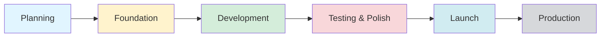
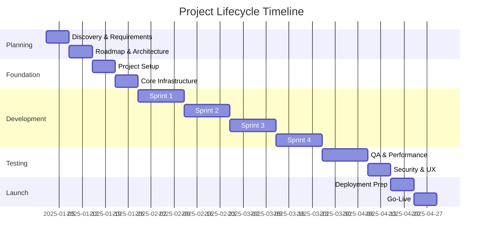
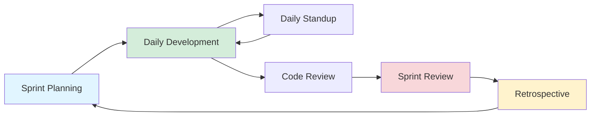

# Project Lifecycle Workflow v2.1

**Template Version:** 2.1
**Workflow Version:** 1.0
**Last Updated:** 2025-11-09

---

## 🎯 Overview

This document defines the complete project lifecycle workflow from initial planning through production launch. It provides a **universal framework** that adapts to different build approaches (MVP-First, Complete Build, Growth-Stage) while maintaining consistent quality practices.

### Purpose

- Provide clear guidance through each project phase
- Define daily and weekly practices
- Integrate with existing templates and tools
- Ensure GitHub health and code quality
- Track progress transparently

### Quick Navigation

- [Lifecycle Diagram](#lifecycle-diagram)
- [Daily Practices](#daily-practices)
- [Weekly Practices](#weekly-practices)
- [Phase 1: Planning](#phase-1-planning-1-2-weeks)
- [Phase 2: Foundation](#phase-2-foundation-1-2-weeks)
- [Phase 3: Development](#phase-3-development-4-8-weeks)
- [Phase 4: Testing & Polish](#phase-4-testing--polish-2-3-weeks)
- [Phase 5: Launch Preparation](#phase-5-launch-preparation-1-2-weeks)
- [Integration Guide](#integration-guide)
- [Build Approach Adaptations](#build-approach-adaptations)

---

## 📊 Lifecycle Diagram



### Phase Timeline (Typical)



---

## ⚙️ Daily Practices

**CRITICAL:** These practices are **mandatory** throughout all phases.

### Morning Routine (15-30 minutes)

1. **Check GitHub Actions Health**
   ```bash
   bash scripts/check-github-health.sh
   ```
   - **If failures found:** Stop and fix immediately (zero-tolerance policy)
   - **If warnings:** Investigate and plan fix
   - **If green:** Proceed with day's work

2. **Review Yesterday's Work**
   - Check git log: `git log --oneline --since="yesterday"`
   - Review PRs and code review feedback
   - Check for any pending notifications

3. **Plan Today's Tasks**
   - Open `.project-workflow.json`
   - Review current phase checklist
   - Select 1-3 tasks to complete today
   - Set priorities based on blockers and dependencies

### During Work

1. **Commit Frequently**
   - **Minimum:** Once per day
   - **Recommended:** Multiple times per day
   - Use conventional commits: `feat:`, `fix:`, `docs:`, etc.
   - Write meaningful commit messages

2. **Update Progress**
   - Mark tasks as completed in `.project-workflow.json`
   - Update completion percentages
   - Document blockers or issues

3. **Document Decisions**
   - Use `technical/adr-template.md` for architecture decisions
   - Add inline comments for complex logic
   - Update README or docs as needed

4. **Fix Errors Immediately**
   - **GitHub Actions failures:** Fix before new commits
   - **Linting errors:** Fix before pushing
   - **Test failures:** Fix or update tests
   - **Security alerts:** Address same day

### End of Day (15-30 minutes)

1. **Push All Code**
   ```bash
   git push origin <branch>
   ```
   - Pre-push hook will check GitHub Actions status
   - If blocked, fix failures before pushing

2. **Update Workflow State**
   - Update `.project-workflow.json` with completed tasks
   - Update `.project-state.json` if phase changed
   - Calculate completion percentage

3. **Check GitHub Actions (Again)**
   ```bash
   gh run list --limit 1
   ```
   - Verify latest push didn't break anything
   - If failures, stay late to fix (don't leave broken)

4. **Plan Tomorrow**
   - Review next tasks in workflow
   - Note any blockers or dependencies
   - Set next day's priorities

### Daily Practice Checklist

```json
{
  "morning": {
    "githubHealthCheck": "✓ | ✗",
    "reviewYesterdaysWork": "✓ | ✗",
    "planTodaysTasks": "✓ | ✗"
  },
  "during": {
    "committedCode": "✓ | ✗",
    "updatedProgress": "✓ | ✗",
    "fixedErrorsImmediately": "✓ | ✗"
  },
  "endOfDay": {
    "pushedCode": "✓ | ✗",
    "updatedWorkflowState": "✓ | ✗",
    "verifiedGitHubActionsGreen": "✓ | ✗",
    "plannedTomorrow": "✓ | ✗"
  }
}
```

---

## 📅 Weekly Practices

### Monday: Sprint Planning (If in Development Phase)

**Time:** 1-2 hours

1. **Sprint Review (Previous Sprint)**
   - Review completed vs planned work
   - Calculate velocity
   - Document wins and learnings

2. **Sprint Planning (Next Sprint)**
   - Select user stories from backlog
   - Break into tasks
   - Assign story points
   - Set sprint goal
   - Use `sprints/sprint-plan-template.md`

3. **Set Weekly Goals**
   - Define success criteria for the week
   - Identify potential blockers
   - Allocate time for each goal

### Wednesday: Mid-Week Check

**Time:** 30 minutes

1. **Progress Review**
   - Are we on track for sprint/phase goals?
   - Any blockers that need addressing?
   - Adjust priorities if needed

2. **GitHub Health Trend**
   - Review workflow success rate
   - Check for recurring failures
   - Plan fixes for any patterns

### Friday: Sprint Review & Retrospective

**Time:** 1-2 hours

1. **Sprint Review**
   - Demo completed features
   - Update `.project-workflow.json`
   - Document deliverables
   - Use `sprints/retrospective-template.md`

2. **Code Quality Review**
   - Check test coverage trends
   - Review code review feedback patterns
   - Plan technical debt reduction

3. **Plan Next Week**
   - Preview next sprint
   - Prepare for Monday planning
   - Document any changes needed

### Weekly Health Checks

1. **Security Alerts**
   ```bash
   gh api repos/{owner}/{repo}/dependabot/alerts
   ```
   - Review and triage alerts
   - Update dependencies with vulnerabilities

2. **Dependency Updates**
   - Check for outdated packages
   - Plan updates for non-breaking changes
   - Test major version upgrades in separate branch

3. **Documentation Review**
   - Update README if out of date
   - Review and update technical docs
   - Check if ADRs need updates

---

## 🔷 Phase 1: Planning (1-2 weeks)

### Overview

**Goal:** Understand the problem, define the solution, plan the approach.

**Entry Criteria:**
- New project created from template
- User ready to define product vision

**Exit Criteria (Recommended):**
- ✅ Product roadmap complete (Now/Next/Later defined)
- ✅ Architecture decisions documented (at least 2-3 ADRs)
- ✅ Success metrics defined (OKRs or similar)
- ✅ Sprint 1 plan created
- ✅ All planning tasks in `.project-workflow.json` marked complete

**Typical Duration:** 1-2 weeks (can be shorter for MVP-First approach)

### Phase Checklist

Use `.project-workflow.json` → `phases.planning.checklist`:

1. **Complete Discovery Questions**
   - Team type (solo, small team, enterprise)
   - Build approach (MVP-First, Complete Build, Growth-Stage)
   - Product concept and target users
   - Multi-tenant requirements
   - **Template:** `_START-HERE.md`

2. **Create Product Roadmap**
   - Define Now/Next/Later/Future
   - Prioritize features
   - Identify MVP scope
   - **Template:** `product/roadmap-template.md`

3. **Define Architecture & Technical Decisions**
   - Technology stack
   - Database design (SQL vs NoSQL, schema approach)
   - Authentication strategy
   - Deployment platform (Azure, AWS, etc.)
   - **Template:** `technical/adr-template.md`

4. **Set OKRs and Success Metrics**
   - Define objectives and key results
   - Set measurable goals
   - Plan tracking/analytics
   - **Template:** `business/okr-template.md`

5. **Create Sprint 1 Plan**
   - Break down foundation work
   - Estimate tasks
   - Set sprint goal
   - **Template:** `sprints/sprint-plan-template.md`

### Key Activities

**Discovery:**
- User research and interviews (if applicable)
- Competitive analysis
- Feature brainstorming
- Risk identification

**Planning:**
- Roadmap creation using Now/Next/Later framework
- Database schema design
- API design (high-level)
- Security requirements definition

**Documentation:**
- ADRs for major decisions
- Product requirements (PRD)
- Technical specifications
- Risk register

### Daily Practices in Planning Phase

**Modified for Planning:**
- Commits may be documentation-heavy (ADRs, specs, roadmaps)
- GitHub Actions may not be active yet (fewer workflows)
- Focus on document quality and completeness

### Common Pitfalls

❌ **Over-planning:** Don't spend months planning, 1-2 weeks max
❌ **Under-planning:** Don't skip architecture decisions
❌ **Scope creep:** Keep MVP focused, save features for "Next" or "Later"
❌ **Ignoring multi-tenancy:** Decide this early, hard to retrofit

### Outputs

- ✅ `product/roadmap.md` - Complete product roadmap
- ✅ `technical/adr/` - 2-5 architecture decision records
- ✅ `business/okrs.md` - Objectives and key results
- ✅ `sprints/sprint-01-plan.md` - First sprint plan
- ✅ `.project-workflow.json` - Planning phase 100% complete

### Transition to Foundation

**Before moving to Foundation phase:**

1. Review checklist: All planning tasks complete?
2. Ask: "Do we have clarity on MVP scope and architecture?"
3. Verify: Sprint 1 plan is actionable (can start coding)
4. Check: GitHub repo exists and workflows configured?

**If yes:** Proceed to Foundation phase
**If no:** Identify gaps and complete planning

---

## 🏗️ Phase 2: Foundation (1-2 weeks)

### Overview

**Goal:** Build the technical foundation for the application.

**Entry Criteria:**
- Planning phase complete
- Architecture decisions made
- Sprint 1 plan ready

**Exit Criteria (Recommended):**
- ✅ Project scaffolded with all dependencies
- ✅ Database connected and migrations working
- ✅ Authentication implemented and tested
- ✅ CI/CD pipeline green (all tests passing)
- ✅ Development environment documented
- ✅ All foundation tasks in `.project-workflow.json` marked complete

**Typical Duration:** 1-2 weeks

### Phase Checklist

Use `.project-workflow.json` → `phases.foundation.checklist`:

1. **Initialize Project Structure & Dependencies**
   - Set up frontend (React, Next.js, etc.)
   - Set up backend (Node.js, Python, etc.)
   - Install and configure dependencies
   - Configure linters and formatters
   - Set up environment variables

2. **Set Up Database Schema & Migrations**
   - Create initial schema
   - Set up migration system
   - Configure connection pooling
   - Test database connectivity
   - **Azure:** Use PostgreSQL Flexible Server or Cosmos DB

3. **Implement Authentication & Authorization**
   - User registration and login
   - Password hashing
   - Session management or JWT
   - Role-based access control (if needed)
   - Multi-tenant isolation (if applicable)

4. **Set Up CI/CD Pipeline**
   - Configure GitHub Actions workflows
   - Set up test runner
   - Configure linting and type checking
   - Set up deployment automation (optional in foundation)
   - **Verify:** All workflows passing (green)

5. **Configure Testing Framework**
   - Unit testing setup (Jest, pytest, etc.)
   - Integration testing setup
   - Test database configuration
   - Code coverage reporting
   - Write first few tests

6. **Verify All GitHub Actions Passing**
   - Run `bash scripts/check-github-health.sh`
   - Fix any failures
   - Ensure green status before proceeding

### Key Activities

**Infrastructure Setup:**
- Local development environment
- Database setup (local and dev environments)
- Environment variable management
- Docker configuration (optional)

**Core Systems:**
- Authentication service
- API framework setup
- Database models/schemas
- Error handling patterns

**Quality Assurance:**
- Testing framework
- CI/CD pipelines
- Code quality tools (ESLint, Prettier, etc.)
- Git hooks enabled

**Azure-Specific (if using Azure template):**
- Resource naming conventions applied
- Key Vault for secrets
- App Service or Container Apps setup
- Managed Identity configuration

### Daily Practices in Foundation Phase

**Modified for Foundation:**
- Expect frequent commits (infrastructure setup)
- GitHub Actions will be actively running (monitor closely)
- May have breaking changes frequently (normal during setup)
- Focus on getting to "green" status

### Common Pitfalls

❌ **Over-engineering:** Don't build everything, focus on essentials
❌ **Skipping tests:** Set up testing from day 1
❌ **Ignoring CI/CD:** Don't defer pipeline setup
❌ **Hard-coded secrets:** Use environment variables and Key Vault
❌ **Skipping documentation:** Document setup process

### Outputs

- ✅ Runnable application (even if minimal)
- ✅ Database connected with initial schema
- ✅ Authentication working
- ✅ GitHub Actions green
- ✅ Testing framework operational
- ✅ Development environment documented
- ✅ `.project-workflow.json` - Foundation phase 100% complete

### Transition to Development

**Before moving to Development phase:**

1. Review checklist: All foundation tasks complete?
2. Verify: Can a new developer clone and run the project?
3. Check: All GitHub Actions workflows passing?
4. Test: Authentication working end-to-end?
5. Confirm: Database migrations working?

**If yes:** Proceed to Development phase
**If no:** Fix gaps in foundation (critical to get this right)

---

## 🚀 Phase 3: Development (4-8 weeks)

### Overview

**Goal:** Build core features through iterative sprints.

**Entry Criteria:**
- Foundation phase complete
- Deployable application exists
- GitHub Actions green

**Exit Criteria (Recommended):**
- ✅ All "Now" features from roadmap complete
- ✅ Sprint goals achieved (typically 2-4 sprints)
- ✅ Code review process followed
- ✅ Test coverage ≥60% (target 80%)
- ✅ GitHub Actions consistently green
- ✅ All development tasks in `.project-workflow.json` marked complete

**Typical Duration:** 4-8 weeks (varies by project size)

### Phase Checklist

Use `.project-workflow.json` → `phases.development.checklist`:

1. **Complete Sprint 1 (Core Features)**
   - Implement highest priority features
   - Write tests for new code
   - Code review all changes
   - Update documentation
   - **Template:** `sprints/sprint-plan-template.md`

2. **Complete Sprint 2 (Key Workflows)**
   - Implement primary user workflows
   - Refine UX based on feedback
   - Increase test coverage
   - Optimize performance

3. **Complete Sprint 3+ (Integrations/Polish)**
   - Third-party integrations
   - Advanced features
   - Edge cases and error handling
   - Performance optimizations

4. **Code Review & Refactoring**
   - Review all code for quality
   - Refactor complex areas
   - Reduce technical debt
   - Improve code documentation

5. **Maintain GitHub Actions Green**
   - **Zero failures tolerated**
   - Fix breaks immediately
   - Monitor workflow success rate
   - Update dependencies regularly

### Sprint-Based Development

**Sprint Duration:** 1-2 weeks (recommended)

**Sprint Workflow:**



**Monday:** Sprint planning
- Review backlog
- Select user stories
- Break into tasks
- Set sprint goal

**Tuesday-Thursday:** Development
- Implement features
- Write tests
- Code reviews
- Daily commits

**Friday:** Sprint review & retrospective
- Demo completed work
- Discuss what went well/poorly
- Plan improvements
- Update metrics

### Key Activities

**Feature Development:**
- User stories → tasks → code
- Test-driven development (TDD) recommended
- Continuous integration
- Feature flags for incomplete features

**Code Quality:**
- Peer code reviews (required)
- Automated testing
- Linting and formatting
- Refactoring sessions

**Collaboration:**
- Daily standups (if team)
- Pair programming (optional)
- Knowledge sharing
- Documentation updates

**Integration:**
- Third-party APIs
- Payment providers (Stripe, etc.)
- Email services (SendGrid, etc.)
- Analytics (Mixpanel, Amplitude, etc.)

### Daily Practices in Development Phase

**Standard practices apply:**
- Morning GitHub health check
- Multiple commits per day
- End of day push (green status)
- Update sprint progress daily

**Additional for Development:**
- Code reviews before merge
- Update test coverage
- Document new APIs
- Update `.project-workflow.json` sprint progress

### Common Pitfalls

❌ **Skipping tests:** Don't defer test writing
❌ **Large commits:** Keep commits small and focused
❌ **Ignoring code review feedback:** Address all comments
❌ **Feature creep:** Stick to sprint plan
❌ **Ignoring GitHub failures:** Fix immediately
❌ **Poor documentation:** Document as you go

### Outputs

- ✅ Functional features matching roadmap "Now" section
- ✅ Test coverage ≥60% (ideally 80%+)
- ✅ Code reviewed and approved
- ✅ Documentation updated
- ✅ GitHub Actions consistently green
- ✅ `.project-workflow.json` - Development phase 100% complete

### Transition to Testing

**Before moving to Testing phase:**

1. Review checklist: All planned sprints complete?
2. Verify: Core features working end-to-end?
3. Check: Test coverage meets minimum threshold (60%)?
4. Confirm: GitHub Actions green for at least 3 consecutive days?
5. Validate: No known critical bugs?

**If yes:** Proceed to Testing & Polish phase
**If no:** Complete additional sprints or fix issues

---

## 🧪 Phase 4: Testing & Polish (2-3 weeks)

### Overview

**Goal:** Ensure production-ready quality through comprehensive testing and optimization.

**Entry Criteria:**
- Development phase complete
- Core features implemented
- Test coverage ≥60%

**Exit Criteria (Recommended):**
- ✅ Test coverage ≥80%
- ✅ Performance benchmarks met
- ✅ Security audit passed
- ✅ User acceptance testing complete
- ✅ All critical and high-priority bugs fixed
- ✅ All testing tasks in `.project-workflow.json` marked complete

**Typical Duration:** 2-3 weeks

### Phase Checklist

Use `.project-workflow.json` → `phases.testing.checklist`:

1. **Achieve 80%+ Test Coverage**
   - Write missing unit tests
   - Add integration tests
   - Test edge cases
   - Test error handling
   - Run coverage reports

2. **Run Performance Benchmarks & Optimize**
   - Load testing (Apache Bench, k6, etc.)
   - Database query optimization
   - Frontend performance (Lighthouse)
   - API response times
   - Caching implementation

3. **Complete Security Audit**
   - Dependency vulnerability scan
   - OWASP Top 10 review
   - Authentication/authorization review
   - Data encryption validation
   - Secret management audit
   - **Azure:** Use Defender for Cloud

4. **User Acceptance Testing**
   - Manual testing of all workflows
   - Cross-browser testing
   - Mobile responsiveness testing
   - Accessibility testing (WCAG)
   - User feedback collection

5. **Fix All Critical & High-Priority Bugs**
   - Triage bug backlog
   - Fix critical bugs (blocking)
   - Fix high-priority bugs
   - Document known issues (low priority)
   - Verify fixes with tests

### Key Activities

**Testing:**
- Unit testing (comprehensive)
- Integration testing
- End-to-end testing
- Performance testing
- Security testing
- Accessibility testing

**Optimization:**
- Database indexing
- Query optimization
- Frontend bundling
- Image optimization
- Caching strategies
- CDN setup

**Quality Assurance:**
- Bug triage and fixing
- Regression testing
- Cross-platform testing
- Documentation review
- Code cleanup

### Testing Checklist

**Functional Testing:**
- [ ] All user workflows tested
- [ ] Authentication flows tested
- [ ] Authorization rules verified
- [ ] Payment processing tested (if applicable)
- [ ] Email notifications working
- [ ] API endpoints tested

**Non-Functional Testing:**
- [ ] Performance under load
- [ ] Security vulnerabilities addressed
- [ ] Accessibility standards met (WCAG AA)
- [ ] Browser compatibility verified
- [ ] Mobile responsiveness validated
- [ ] Error handling tested

**Data Integrity:**
- [ ] Database constraints tested
- [ ] Data validation working
- [ ] Multi-tenant isolation verified (if applicable)
- [ ] Backup/restore tested
- [ ] Migration rollback tested

### Daily Practices in Testing Phase

**Standard practices apply:**
- Morning GitHub health check
- Daily commits (test additions, bug fixes)
- End of day push (green status)

**Additional for Testing:**
- Run test suites frequently
- Document bugs as found
- Prioritize bug fixes
- Re-test after fixes

### Performance Targets

**Frontend:**
- Lighthouse score ≥90
- First Contentful Paint <2s
- Time to Interactive <4s
- Page weight <2MB

**Backend:**
- API response time <200ms (95th percentile)
- Database query time <100ms
- Handle 100 concurrent users
- Zero unhandled errors

**Azure-Specific:**
- App Service response time <500ms
- Database DTU usage <80%
- CDN cache hit ratio >80%

### Common Pitfalls

❌ **Skipping testing:** Don't defer to post-launch
❌ **Manual-only testing:** Automate everything possible
❌ **Ignoring performance:** Don't wait for users to complain
❌ **Security as afterthought:** Security should be continuous
❌ **Skipping edge cases:** Test boundary conditions

### Outputs

- ✅ Test coverage ≥80%
- ✅ Performance benchmarks documented and met
- ✅ Security audit report (pass)
- ✅ Bug backlog triaged and prioritized
- ✅ Critical bugs fixed
- ✅ Test results documented
- ✅ `.project-workflow.json` - Testing phase 100% complete

### Transition to Launch

**Before moving to Launch phase:**

1. Review checklist: All testing tasks complete?
2. Verify: Test coverage ≥80%?
3. Check: Performance targets met?
4. Confirm: Security audit passed?
5. Validate: No critical bugs remaining?
6. Test: Can deploy to production without errors?

**If yes:** Proceed to Launch Preparation phase
**If no:** Address gaps before launching

---

## 🎉 Phase 5: Launch Preparation (1-2 weeks)

### Overview

**Goal:** Prepare for production deployment and go-live.

**Entry Criteria:**
- Testing phase complete
- Quality gates passed
- Application production-ready

**Exit Criteria (Recommended):**
- ✅ Production environment configured
- ✅ Monitoring and alerting active
- ✅ Deployment runbook complete
- ✅ Go-live checklist executed
- ✅ Post-launch monitoring plan in place
- ✅ All launch tasks in `.project-workflow.json` marked complete

**Typical Duration:** 1-2 weeks

### Phase Checklist

Use `.project-workflow.json` → `phases.launch.checklist`:

1. **Set Up Production Environment**
   - Provision production resources
   - Configure environment variables
   - Set up production database
   - Configure CDN and caching
   - Set up SSL/TLS certificates
   - **Azure:** Use production SKUs, enable scaling

2. **Configure Monitoring & Alerting**
   - Application monitoring (New Relic, Datadog, etc.)
   - Error tracking (Sentry, Rollbar, etc.)
   - Uptime monitoring (Pingdom, UptimeRobot, etc.)
   - Log aggregation (CloudWatch, Log Analytics, etc.)
   - Alert rules configured
   - **Azure:** Application Insights, Log Analytics

3. **Complete Deployment Runbook**
   - Document deployment process
   - Define rollback procedure
   - Create incident response plan
   - Document known issues
   - Define on-call procedures (if applicable)
   - **Template:** `workflows/runbook-template.md`

4. **Execute Go-Live Checklist**
   - DNS configuration
   - Email deliverability verified
   - Payment gateway activated (if applicable)
   - Analytics tracking verified
   - Backup strategy tested
   - Security measures active

5. **Post-Launch Monitoring (48 hours)**
   - Monitor error rates
   - Track performance metrics
   - Review user feedback
   - Address critical issues immediately
   - Document lessons learned

### Key Activities

**Infrastructure:**
- Production environment setup
- Database migration
- CDN configuration
- Load balancer setup
- SSL certificates

**Monitoring:**
- APM tools configured
- Error tracking active
- Uptime monitoring
- Log aggregation
- Dashboards created

**Deployment:**
- CI/CD to production
- Blue-green or rolling deployment
- Database migration strategy
- Rollback plan tested
- Smoke tests defined

**Documentation:**
- Deployment runbook
- Incident response plan
- Architecture diagrams
- API documentation
- User documentation

### Go-Live Checklist

**Pre-Launch (T-minus 1 week):**
- [ ] Production environment configured
- [ ] Monitoring tools active
- [ ] Deployment tested in staging
- [ ] Backup strategy verified
- [ ] DNS configured (not switched yet)
- [ ] Team briefed on launch plan

**Launch Day (T-0):**
- [ ] Deploy to production
- [ ] Switch DNS (if applicable)
- [ ] Verify all services running
- [ ] Test critical workflows
- [ ] Monitor error rates
- [ ] Announce launch (if applicable)

**Post-Launch (T+48 hours):**
- [ ] Monitor continuously
- [ ] Address any issues immediately
- [ ] Collect user feedback
- [ ] Review metrics
- [ ] Document lessons learned
- [ ] Plan post-launch improvements

### Daily Practices in Launch Phase

**Standard practices apply:**
- Morning GitHub health check
- Daily commits (infrastructure, docs)
- End of day push (green status)

**Additional for Launch:**
- Monitor production environment
- Test deployment procedures
- Verify monitoring alerts
- Practice rollback procedures

### Azure-Specific Launch Checklist

**Production Environment:**
- [ ] App Service production tier (P1V2 or higher)
- [ ] PostgreSQL production tier (GP or higher)
- [ ] Redis Premium tier (if using)
- [ ] Managed Identity configured
- [ ] Key Vault production configuration
- [ ] Application Insights active
- [ ] Log Analytics workspace configured
- [ ] Defender for Cloud enabled

**Scaling & Performance:**
- [ ] Auto-scaling rules configured
- [ ] CDN enabled
- [ ] Database connection pooling
- [ ] Caching strategy implemented

**Security:**
- [ ] Network security groups configured
- [ ] Private endpoints enabled (if required)
- [ ] DDoS protection enabled
- [ ] WAF configured (if using Front Door)
- [ ] Secrets in Key Vault (not environment variables)

### Common Pitfalls

❌ **Rushing launch:** Don't skip steps to launch faster
❌ **No rollback plan:** Always have a way to rollback
❌ **Poor monitoring:** Know when things break
❌ **Untested deployment:** Test deployment multiple times
❌ **No incident plan:** Plan for things to go wrong

### Outputs

- ✅ Production environment live
- ✅ Monitoring and alerting active
- ✅ Deployment runbook documented
- ✅ Go-live checklist complete
- ✅ Post-launch metrics tracked
- ✅ Lessons learned documented
- ✅ `.project-workflow.json` - Launch phase 100% complete

### Transition to Production

**After launch:**

1. **Continue daily practices:**
   - GitHub health checks
   - Code reviews
   - Testing
   - Documentation

2. **Add production practices:**
   - Monitor production metrics
   - Review error rates daily
   - Track user feedback
   - Plan iterations

3. **Move to maintenance mode:**
   - Bug fixes and patches
   - Performance optimizations
   - Feature iterations
   - Security updates

---

## 🔗 Integration Guide

### How Workflow Integrates with Existing Templates

**Planning Phase:**
- Uses `product/roadmap-template.md`
- Uses `technical/adr-template.md`
- Uses `business/okr-template.md`
- Uses `sprints/sprint-plan-template.md`

**Foundation Phase:**
- Uses `technical/architecture-template.md`
- Uses `technical/api-spec-template.md`
- Creates `.env.local` from `.env.example`

**Development Phase:**
- Uses `sprints/sprint-plan-template.md` (multiple sprints)
- Uses `sprints/user-story-template.md`
- Uses `sprints/retrospective-template.md`

**Testing Phase:**
- Uses testing checklists
- Uses performance benchmarking tools
- Uses security audit templates

**Launch Phase:**
- Uses `workflows/runbook-template.md`
- Uses deployment checklists
- Uses incident response templates

### How Workflow Integrates with Existing Systems

**GitHub Health Monitoring:**
- Daily practices include `bash scripts/check-github-health.sh`
- Pre-push hook enforces zero-tolerance policy
- Part of every phase's daily routine

**Git Automation:**
- Pre-commit hook validates no placeholders
- Commit-msg hook enforces conventional commits
- Pre-push hook checks GitHub Actions status
- Post-commit hook can auto-generate docs

**Documentation Automation:**
- `generate_session_doc.py` for sprint summaries
- `generate_changelog.py` for release notes
- `generate_adr.py` for architecture decisions

**SQLite Database:**
- `.project-state.json` syncs to `verdaio-dashboard.db`
- Dashboard shows workflow progress across projects
- Phase completion tracked in database

### Workflow State Management

**Two files track workflow state:**

1. **`.project-state.json`** (high-level)
   ```json
   {
     "version": "2.1",
     "state": { "phase": "development" },
     "workflow": {
       "currentPhase": "development",
       "phasesCompleted": ["planning", "foundation"],
       "lastPhaseTransition": "2025-11-09"
     }
   }
   ```

2. **`.project-workflow.json`** (detailed)
   ```json
   {
     "currentPhase": "development",
     "phases": {
       "development": {
         "status": "in-progress",
         "completionPercent": 45,
         "checklist": [ /* detailed tasks */ ]
       }
     }
   }
   ```

**Sync strategy:**
- `.project-workflow.json` is source of truth for tasks
- `.project-state.json` reflects current phase
- Database syncs from `.project-state.json`

---

## 🎯 Build Approach Adaptations

### MVP-First Approach

**Characteristics:**
- Fast time to market
- Minimal feature set
- Solo founder or small team
- Tight budget

**Workflow Adjustments:**
- **Planning:** 3-5 days (not 1-2 weeks)
- **Foundation:** 1 week (minimal setup)
- **Development:** 2-4 weeks (1-2 sprints only)
- **Testing:** 1 week (basic testing, 60% coverage OK)
- **Launch:** 3-5 days (minimal monitoring)

**Focus:**
- Core user workflow only
- "Now" features from roadmap
- Manual processes OK initially
- Deploy fast, iterate based on feedback

### Complete Build Approach

**Characteristics:**
- Full feature set upfront
- Professional team
- Adequate budget and timeline
- Enterprise or complex product

**Workflow Adjustments:**
- **Planning:** 2 weeks (thorough planning)
- **Foundation:** 2 weeks (robust infrastructure)
- **Development:** 6-8 weeks (3-4 sprints)
- **Testing:** 3 weeks (comprehensive testing, 80%+ coverage)
- **Launch:** 2 weeks (full production setup)

**Focus:**
- All "Now" and some "Next" features
- Automation from day 1
- Comprehensive testing
- Production-grade infrastructure

### Growth-Stage Approach

**Characteristics:**
- Existing product being enhanced
- Proven product-market fit
- Active user base
- Revenue and team

**Workflow Adjustments:**
- **Planning:** 1 week (feature planning)
- **Foundation:** N/A (already exists)
- **Development:** Continuous (sprints ongoing)
- **Testing:** Continuous (parallel with dev)
- **Launch:** Per feature (continuous deployment)

**Focus:**
- Incremental features
- A/B testing
- Performance optimization
- Scaling infrastructure

---

## 🛠️ Troubleshooting

### Workflow Not Progressing

**Symptom:** Stuck in one phase for too long

**Solutions:**
1. Review `.project-workflow.json` checklist
2. Identify blockers
3. Adjust scope if needed
4. Get help or pair program
5. Consider phase transition even if not 100% complete

### GitHub Actions Constantly Failing

**Symptom:** Can't keep workflows green

**Solutions:**
1. Stop new feature work
2. Focus on fixing failures
3. Review `.github/workflows/` configurations
4. Update dependencies
5. Improve test reliability
6. See `GITHUB-HEALTH-MONITORING.md`

### Low Test Coverage

**Symptom:** Can't reach 80% target

**Solutions:**
1. Write tests for new code first
2. Identify untested areas: `npm run coverage`
3. Focus on critical paths
4. Don't test trivial code
5. Consider testing phase extension

### Scope Creep

**Symptom:** Features growing beyond plan

**Solutions:**
1. Review roadmap (Now/Next/Later)
2. Move new ideas to "Next" or "Later"
3. Stick to sprint commitments
4. Use feature flags for incomplete work
5. Defer non-essential features

---

## 📊 Metrics and Tracking

### Phase Metrics

Track in `.project-workflow.json`:
- Completion percentage per phase
- Time spent in each phase
- Number of tasks completed vs total

### Development Metrics

Track during sprints:
- Velocity (story points per sprint)
- Commit frequency
- Code review turnaround time
- Test coverage percentage

### Quality Metrics

Track throughout:
- GitHub Actions success rate
- Number of failing workflows
- Bug count by severity
- Test coverage trend
- Performance scores (Lighthouse, etc.)

---

## 📚 Additional Resources

**Template Files:**
- `product/` - Product planning templates
- `sprints/` - Sprint planning and tracking
- `technical/` - Technical documentation
- `business/` - Business planning and metrics
- `workflows/` - Process documentation

**Scripts:**
- `scripts/check-github-health.sh` - Daily health check
- `scripts/generate_session_doc.py` - Session documentation
- `scripts/generate_changelog.py` - Changelog generation

**Guides:**
- `DAILY-PRACTICES.md` - Detailed daily routine (see workflows/)
- `GITHUB-HEALTH-MONITORING.md` - GitHub monitoring system
- `DOCUMENTATION-AUTOMATION.md` - Documentation automation

**Tools:**
- `.project-workflow.json` - Interactive checklist
- `.project-state.json` - Project state tracking
- Git hooks (`.githooks/`) - Automated validation

---

## 🔄 Workflow Versioning

**Workflow Version:** 1.0
**Template Version:** 2.1

**Version History:**
- **1.0 (2025-11-09):** Initial workflow system release

**Future Enhancements:**
- Phase transition automation
- Workflow analytics dashboard
- AI-assisted task suggestions
- Cross-project workflow insights

---

## 📞 Support

**Questions about workflow?**
- Review this document first
- Check `.project-workflow.json` for current state
- Run `bash scripts/check-github-health.sh` if stuck
- Consult CLAUDE.md for AI assistance

**Issues with templates?**
- See `TEMPLATES-INVENTORY.md` for complete list
- Check template-specific README files
- Review examples in template directories

**System issues?**
- GitHub Actions: See `GITHUB-HEALTH-MONITORING.md`
- Git hooks: Check `.githooks/README.md`
- Database: See `verdaio-dashboard.db` documentation

---

**Last Updated:** 2025-11-09
**Workflow Version:** 1.0
**Template Version:** 2.1
**Maintained By:** Template System

---

*Happy building! Follow the workflow, maintain GitHub health, and ship great products.* 🚀
